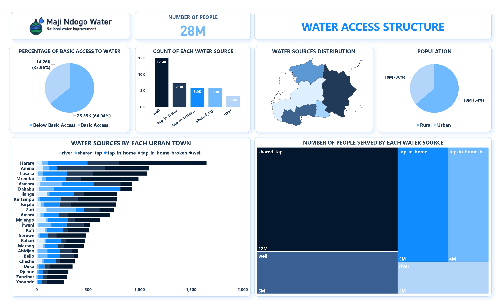
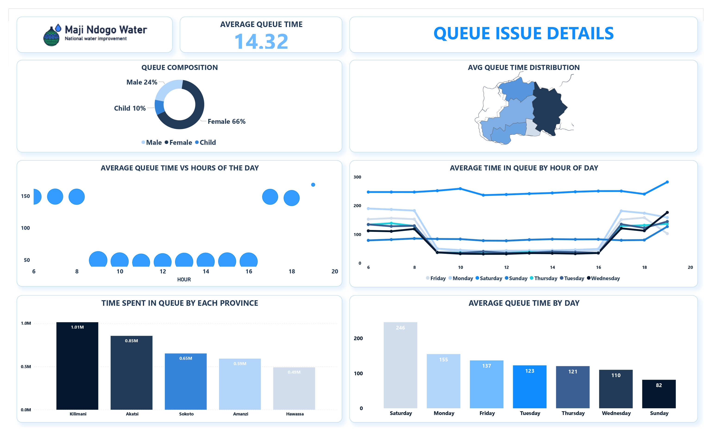
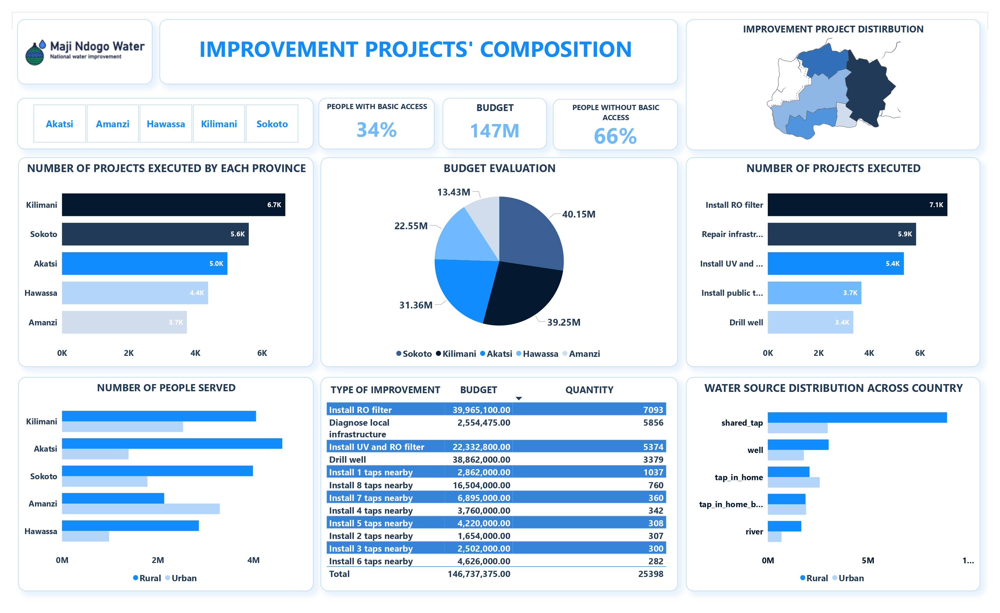
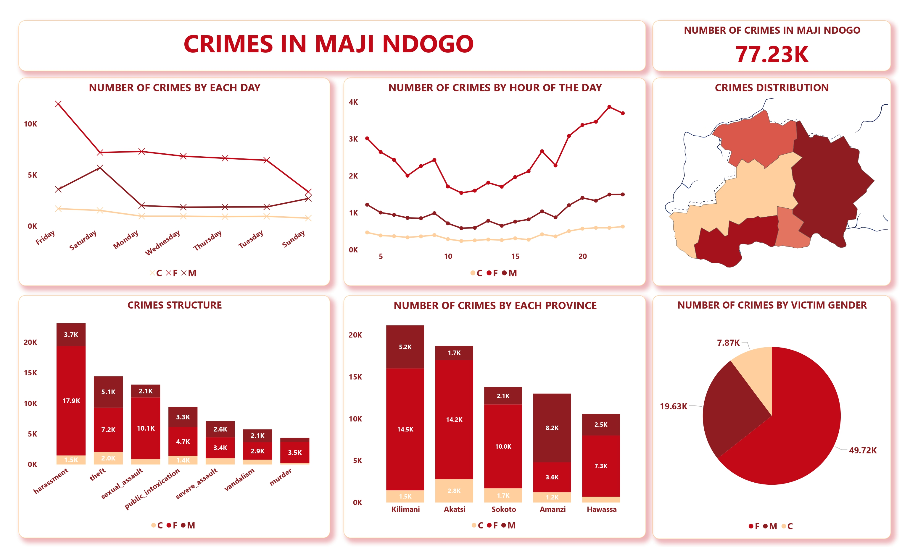
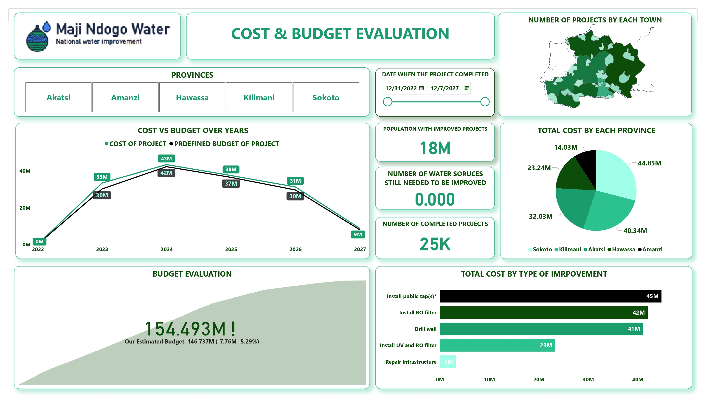
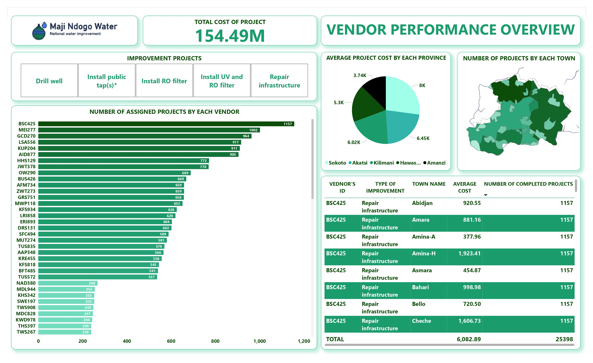

# Water Crises in African Country Project
This repository contains the workflow and insights derived from analyzing the water crisis in Maji Ndogo. The analysis explores water access, infrastructure challenges, crime impact, and budget allocation. A series of dashboards were created using **Power BI** to present actionable insights and support informed decision-making.

---

## Table of Contents

1. [Introduction](#introduction)
2. [Goals and Key Questions](#goals-and-key-questions)
3. [Data Sources](#data-sources)
4. [Tools and Technologies](#tools-and-technologies)
5. [Project Workflow](#project-workflow)
6. [Understanding the Problem](#understanding-the-problem)
   - [Water Access Structure](#water-access-structure)
   - [Queue Issue Details](#queue-issue-details)
   - [Improvement Projects Composition](#improvement-projects-composition)
7. [Crimes in Maji Ndogo](#crimes-in-maji-ndogo)
8. [Improvement Projects Analysis](#improvement-projects-analysis)
   - [Cost & Budget Evaluation](#cost--budget-evaluation)
   - [Vendor Performance Overview](#vendor-performance-overview)
9. [Recommendations and Future Plans](#recommendations-and-future-plans)

---

## Introduction

Maji Ndogo faces a severe water crisis impacting its population's daily lives and safety. With limited water access and associated challenges like long queues and high crime rates, the situation demands urgent interventions. This project analyzes key metrics related to water access, crime, and project budgets to offer actionable recommendations. By leveraging Power BI, we aim to support tailored solutions and efficient resource allocation.

---

## Goals and Key Questions

### Goals:
- To understand the extent of water access challenges and infrastructure deficits.
- To evaluate the relationship between water access and crime.
- To provide insights for efficient budget allocation and project prioritization.

### Key Questions:
1. What percentage of the population has basic water access, and what disparities exist?
2. How do long queues for water impact daily life and safety?
3. Which regions require the most urgent interventions?
4. Are resources being allocated efficiently for improvement projects?
5. How does crime relate to water scarcity in Maji Ndogo?

---

## Data Sources

- []

---

## Tools and Technologies

- **Microsoft Excel**: Data cleaning and preparation.
- **SQL**: Data transformation and querying.
- **Power BI**: Data visualization and dashboard creation.

---

## Project Workflow

1. **Data Collection**: Acquired data from government and community sources.
2. **Data Cleaning**: Organized and prepared data using Excel and SQL.
3. **Data Modeling**:
   - Transformed data to analyze water access, crime, and budget allocation.
   - Built relationships between key variables for dashboard visualizations.
4. **Visualization**:
   - Created interactive dashboards in Power BI.

---

## Understanding the Problem

### 1. Water Access Structure

**Key Insights**:
- Only 14.26% of the population has basic water access, highlighting a severe crisis.
- Shared water sources dominate, leading to long queues and health risks.
- Urban areas show better access than rural regions, revealing a stark disparity.

**Dashboard Preview**:  

---

### 2. Queue Issue Details

**Key Insights**:
- The average queue time for water is 14.32 minutes, significantly disrupting daily routines.
- Women and children spend the most time in queues, affecting productivity and education.
- Long queue times correlate with higher crime rates around water sources.

**Dashboard Preview**:  

---

### 3. Improvement Projects Composition

**Key Insights**:
- Most improvement projects focus on well drilling and pipeline extensions.
- Budget allocation prioritizes regions with severe water scarcity.
- Urban projects receive higher funding compared to rural interventions.

**Dashboard Preview**:  

---

## Crimes in Maji Ndogo

### 4. Crimes in Maji Ndogo

**Key Insights**:
- High crime rates, particularly theft and harassment, are linked to water scarcity.
- Kilimani is identified as a crime hotspot due to long queues and high population density.
- Women and children are the most vulnerable to crimes at water collection points.

**Dashboard Preview**:  

---

## Improvement Projects Analysis

### 5. Cost & Budget Evaluation

**Key Insights**:
- The total project cost is significant, requiring efficient resource management.
- Budget efficiency varies by region, with some areas overspending compared to outcomes.
- Projects in rural areas often exceed their planned budgets due to logistical challenges.

**Dashboard Preview**:  

---

### 6. Vendor Performance Overview

**Key Insights**:
- Vendor performance is inconsistent, with delays in project completion affecting outcomes.
- High-performing vendors deliver quality work on time and within budget.
- Poor-performing vendors often lack the resources to manage large-scale projects.

**Dashboard Preview**:  

---

## Recommendations and Future Plans

### Recommendations:
1. **Focus on Rural Access**: Increase investments in rural regions with minimal water infrastructure.
2. **Reduce Queue Times**: Expand shared water sources to decrease the burden on vulnerable populations.
3. **Address Crime Hotspots**: Implement security measures at water collection points to ensure safety.
4. **Vendor Accountability**: Monitor vendor performance and establish strict guidelines to improve efficiency.

### Future Plans:
- Develop predictive models to assess the long-term impact of water interventions.
- Enable real-time monitoring of queue times and water access through IoT-enabled systems.
- Explore alternative water sources like rainwater harvesting for sustainable solutions.

---

## Author

- [Ahmed Moustafa Kamal](https://github.com/amoustafakamal31)  
  Data Analyst and Community Development Advocate

